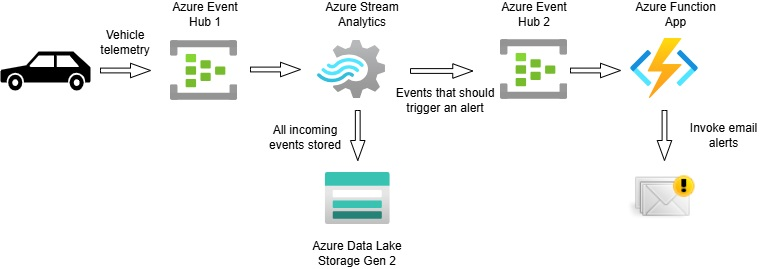

# Real-Time Azure Stream Analytics Vehicle Telemetry Alerting
## Introduction
This is an Azure Stream Analytics project that processes real-time vehicle telemetry events and triggers alerts when a threshold value is reached. A Transaction Generator application is used to simulate vehicle telemetry data and sends these events to Azure Event Hub. Azure Stream Analytics then ingests these events and performs aggregations over time windows. The aggregrated results are then sent to another Event Hub which also acts as a Function App trigger. A Function App is invoked every time an event lands in the second Event Hub.

## Architecture

## Technology Used
1. Programming language - C# (.NET Core)
2. Scripting language - Azure Stream Analytics Query Language
3. Azure Cloud Platform
   * Azure Event Hub
   * Azure Stream Analytics
   * Azure Function App
   * Azure Data Lake Storage Gen 2
   * Azure Communication Service

## Data Source
Vehicle telemetry data generated by a simulator. 
